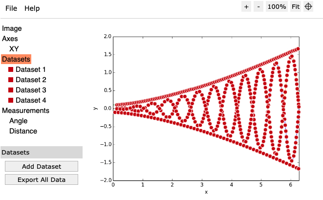

# WebPlotDigitizer

[](https://travis-ci.com/sebastianpech/WebPlotDigitizer.jl)

Load `tar` files generated with [WebPlotDigitizer](https://automeris.io/WebPlotDigitizer/).

## Basic usage

Having a finished WebPlotDigitizer project like



one can load the exported tar project:

```julia-repl
julia> using WebPlotDigitizer
julia> data = WebPlotDigitizer.load_from_tar("scripts/default.tar")
WebPlotDigitizer:
 'XY' XYAxes{Float64}
   Dataset 1
   Dataset 2
   Dataset 3
   Dataset 4
julia> julia> data["XY"]["Dataset 1"]
103×2 Matrix{Float64}:
 0.12  0.105397
 0.18  0.110326
 0.24  0.113625
 0.3   0.120223
 ⋮     
 6.12  1.60259
 6.18  1.62238
 6.24  1.64704
```

## Supported data structures

- [ ] Support für alle plot typen
    - [x] XYPlot
        - [x] XYPlot
        - [x] XYPlot Date
        - [x] XYPlot logscale
    - [ ] Barchart
        - [x] Barchart
        - [ ] Horizontal
        - [ ] Rotated
        - [ ] Labels
    - [ ] Polar
        - [x] Rad
        - [ ] Deg
        - [ ] Clockwise
    - [ ] Ternary
    - [ ] Map with scale bar
    - [ ] Image
    - [ ] kNN sort
    - [ ] Support Measurements